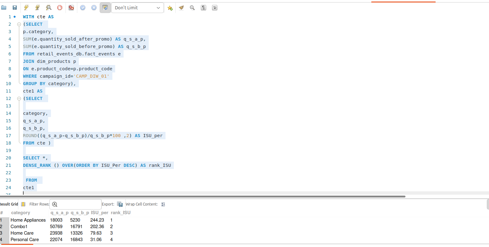
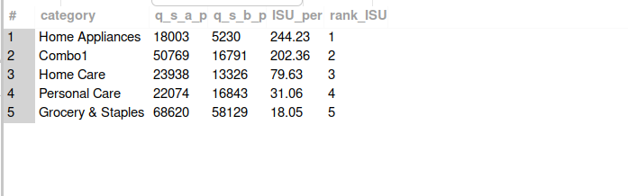
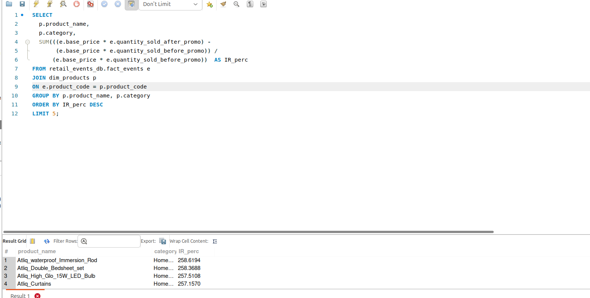

# Atliq Mart: Analyse Marketing Promotion and Provide Tangible Insights to Sales Director

### Created By: Pandidurai || [LinkedIn Profile](https://github.com/pandimech)

---
- [About Atliq Mart](#about-atliq-mart)
- [Project Overview](#project-overview)
- [Problem Statement](#problem-statement)
- [Objective of the Project](#objective-of-the-project)
- [Store Performance Analysis](#store-performance-analysis)
- [Promotion Type Analysis](#promotion-type-analysis)
- [Product And Category Analysis](#product-and-category-analysis)
- [Recommendation](#recommendation)

---

## About Atliq Mart

Atliq is a retail giant with 50 superstores in the southern region of india. They're currenly running massive promotions during the diwali and sankranti festivals in their stores on their branded products.
---
## Project Overview

The project is aims to evaluate the festival promotion runned by Atliq Mart and during this time period, it need to analyze various aspects of sales performance around the stores across multiple cities. Through the sales performance matrics, we seek to analyze the performance of stores and get deep into success of two festival promotion, and provide data-driven recommendation to make informed decsions in the next promotions
---
## Problem Statement

The sales director wants to understand which promotions did well and which did not so he could design the next promotions accordingly.
---

## Objective

Peter Pandey, as a curious data analyst is responsible to analyze atliq mart sales performance during the promotional period and give him convincing presentation about the performance with actionable insights.
---
## Data Sources

The primary sales summary data used for analyze is 'fact_events_xlxs' file along with dim_campaigns, dim_products, dim_stores files to make relational model.
---
## Tools

- SQL - Data Analysis(MySQL)
---
## Ad-hoc Business Request:

### List of products with based price greater than 500 and promo type BOGOF

---
### Number of store in each city to identify cities with highest stores

---
### Total Revenue comparison between before and after promotion 

---
### Diwali Campaign ISU % Calculation for each product category  

---
### Top 5 products ranked by Incremental Revenue Percentage

---
#### Store Performance Analysis
- Which are the top 10 stores in terms of Incremental Revenue(IR) generated from the promotions?
- Which are the bottom 10 stores when it comes to Incremental Sold Units(ISU) during the promotional period?
- How  does the  performance of stores vary by city? Are there any common characteristics among the top-performing stores that could be leveraged across other stores?
---
## Promotion Type Analysis
- What are the top 2 promotion types that resulted in the highest Incremental Revenue?
- What are the bottom 2 promotion types in terms of their impact on Incremental  Sold Units?
- Is there a significant difference in the performance of discount-based promotions versus BOGOF(Buy  One Get One Free) or cashback promotions?
- Which promotions strike the best balance between Incremental Sold Units and maintaining healthy  margins?
---
## Product And Category Analysis
- Which product categories saw the most significant lift in sales from the promotions?
- Are there specific products that respond exceptionally well or poorly to promotions?
- What is the correlation between category and promotion type effect.
---
## Key Findings:
- Bengalure and Chennai emerged as the top-performing cities, achieving the highest Incremental Sold Units and Revenue. However,Mysure has been amazing in its revenue stats though has only 4 stores.
- The top two promotion types,500 cashback and BOGOF (Buy One Get One Free),generated the highest Incremental
Revenue.
- Grocery & Staples,Home Appliances, and Home care categories experienced the most significant lift in sales from
  the promotions.
- Certain products,such as Atliq_waterproof_immersion_red and Atilq_High_Glo_15W_LED_Bulb,exhibited exceptional
  responsiveness to promotions
---
## Recommendation

  -  The 500 cashback promo for combo1 was a big success. They may adapt loyalty and reward offers in future to retain their customer buying.

  -  Atliq should focus on bringing up IR% and ISU% both for cashback promotional and BOGOF. A bundle offer can be interesting to instant boost of target sales and revenue

   - Atliq should be more strategic in terms of discount based promotional offers all togerther to run. This offers push back the promotional revenue so they need to curate their offers carefully to maximixe the reveneu

   - BOGOF has increase in sales volume but the incremental revenue which it generates is less and this reflects on the overall promotion revenue. So rather being focus on this pricing for BOGOF, it could generate healthy margin

   - Bengaluru & Chennai contribute more than 40% of total revenue generated. They could use the customer demographic, buying pattern and response of this location to apply those on other stores which are not performing up to the mark.

   - Personal care products need to have adjustments in pricing and customer engagement or brand engagement activity to offset the negative IR

   - At last Atliq should analyze its customer segment and demographic for all its future promotional activities. This may lead to customize their offers for few of its stores respective of the cities to get better outcome.
---
## Areas for Improvement:

    -  Implement targeted strategies to enhance promotion effectiveness in stores and categories with lower performance.
    -  Conduct further analysis to optimize promotion strategies for product categories that did not exhibit significant sales lift
  ---
 ### Outcome
 
 The analysis provided actionable insights that can potentially lead to increased revenue and improved marketing effectiveness in the future promotional offers for Atliq Mart.

