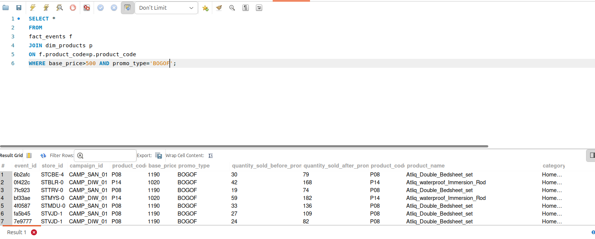
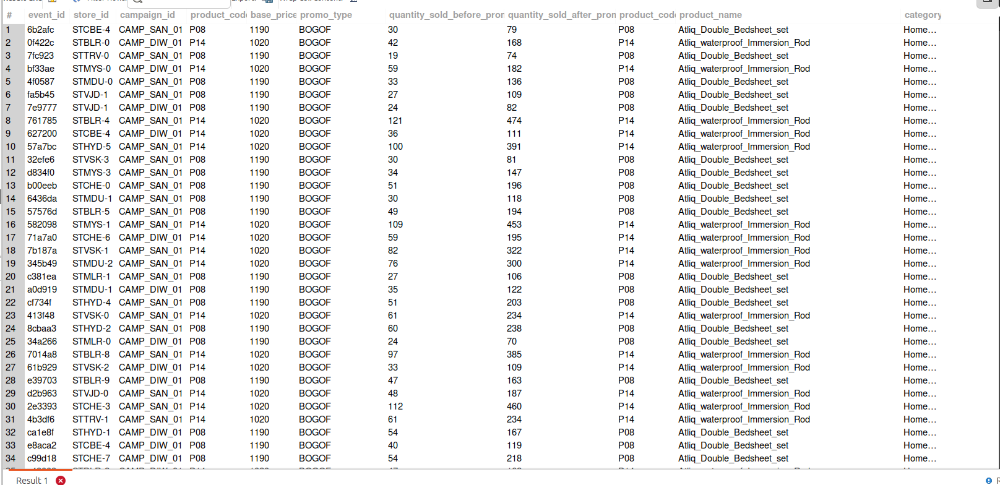
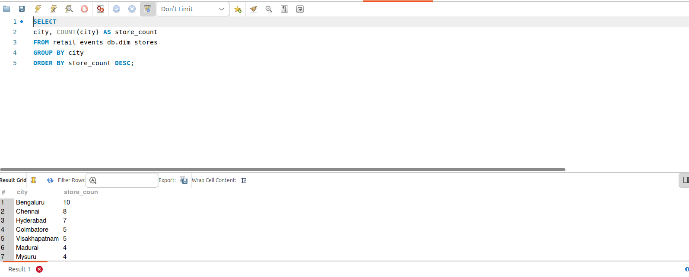
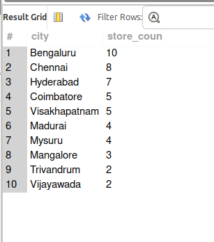
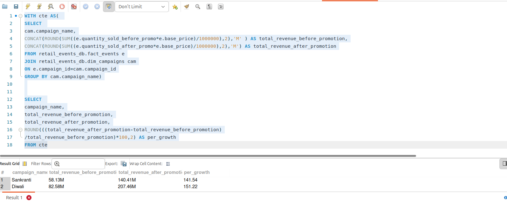
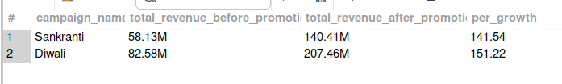
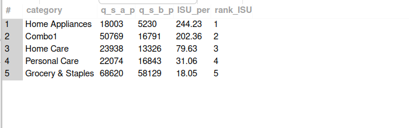

# Atliq Mart: Analyse Marketing Promotion and Provide Tangible Insights to Sales Director

### Created By: Pandidurai || [LinkedIn Profile](https://github.com/pandimech)

---
- [About Atliq Mart](#about-atliq-mart)
- [Project Overview](#project-overview)
- [Problem Statement](#problem-statement)
- [Objective of the Project](#objective-of-the-project)
- [Store Performance Analysis](#store-performance-analysis)
- [Promotion Type Analysis](#promotion-type-analysis)
- [Product And Category Analysis](#product-and-category-analysis)
- [Recommendation](#recommendation)

---

## About Atliq Mart

Atliq is a retail giant with 50 superstores in the southern region of india. They're currenly running massive promotions during the diwali and sankranti festivals in their stores on their branded products.
---
## Project Overview

The project is aims to evaluate the festival promotion runned by Atliq Mart and during this time period, it need to analyze various aspects of sales performance around the stores across multiple cities. Through the sales performance matrics, we seek to analyze the performance of stores and get deep into success of two festival promotion, and provide data-driven recommendation to make informed decsions in the next promotions
---
## Problem Statement

The sales director wants to understand which promotions did well and which did not so he could design the next promotions accordingly.
---

## Objective

Peter Pandey, as a curious data analyst is responsible to analyze atliq mart sales performance during the promotional period and give him convincing presentation about the performance with actionable insights.
---
## Data Sources

The primary sales summary data used for analyze is 'fact_events_xlxs' file along with dim_campaigns, dim_products, dim_stores files to make relational model.
---
## Tools

- SQL - Data Analysis(MySQL)
---
## Ad-hoc Business Request:

### List of products with based price greater than 500 and promo type BOGOF

---
### Number of store in each city to identify cities with highest stores

---
### Total Revenue comparison between before and after promotion 

---
### Diwali Campaign ISU % Calculation for each product category  

---

## Promotion Type Analysis
## Product And Category Analysis
## Recommendation
